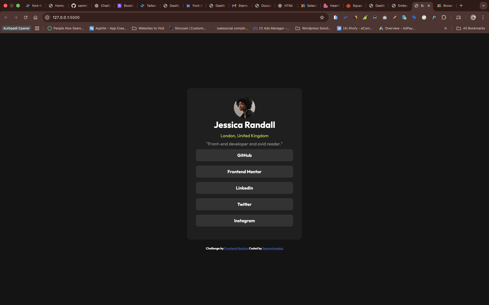

Frontend Mentor - Social Links Profile Solution

This is my solution to the Social Links Profile challenge on Frontend Mentor.
The goal was to recreate the design as closely as possible using semantic HTML and modern CSS.

🔗 Links

🔍 Solution URL: (https://github.com/sammyloaded/Social-Links-Profile)

🚀 Live Site URL: (https://social-links-profile-murex-iota.vercel.app/)

📸 Screenshot

🛠 Built With

Semantic HTML5

CSS3

Flexbox

Mobile-first workflow

Custom hover states

🎯 What I Learned

This challenge helped me improve:

Structuring semantic HTML with proper landmarks

Centering layouts using Flexbox

Creating reusable button styles

Matching spacing and typography from a static design

Paying attention to small UI details like hover states and alignment

Since I didn’t have access to the Figma design, I relied on visual estimation and browser tools to approximate spacing, font sizes, and colors. This helped strengthen my ability to reverse-engineer layouts from screenshots.

⚡ Continued Development

In future projects, I would like to:

Improve accessibility further (ARIA roles, focus states, keyboard navigation)

Write more scalable CSS structure

Explore component-based approaches (e.g., React version)

Refine pixel-perfect design accuracy

💡 Author

GitHub – https://github.com/sammyloaded

Frontend Mentor – (Your Frontend Mentor profile link)

🙌 Acknowledgments

Thanks to Frontend Mentor for providing practical, real-world UI challenges that help sharpen front-end skills.
